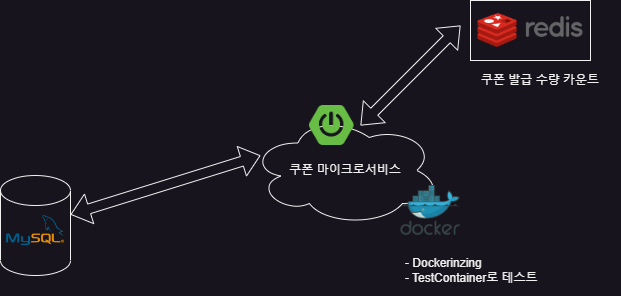
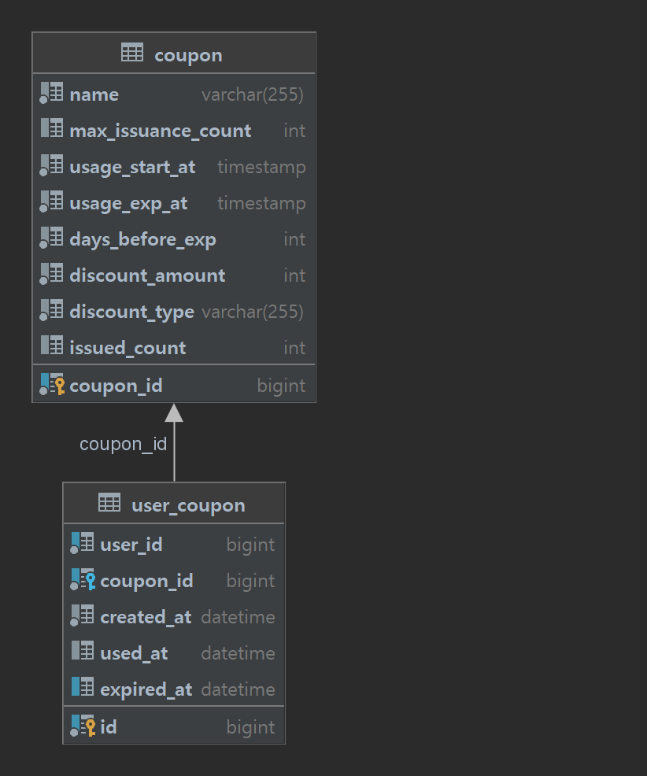
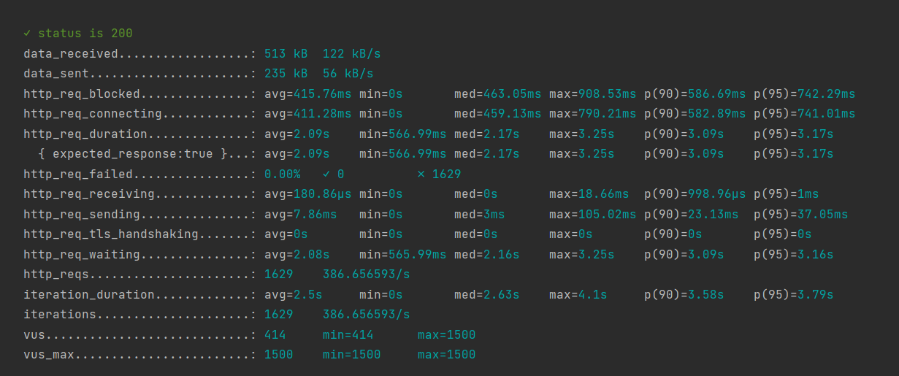
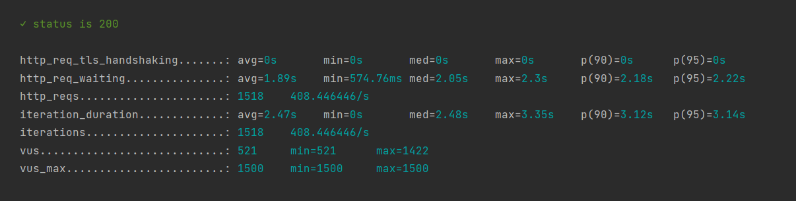
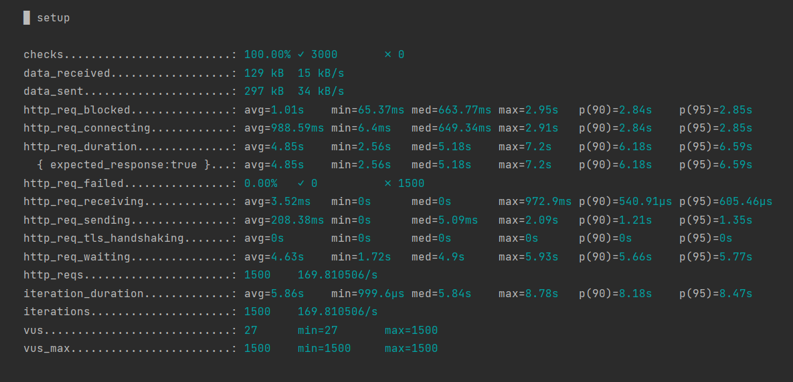

# 프로젝트 README

프로젝트에 오신 것을 환영합니다! 애플리케이션의 원활한 실행을 위해 다음 설치 지침을 따르고 중요한 사항에 유의하십시오.

## 셋업

### 사전 요구사항

애플리케이션을 실행하려면 다음 소프트웨어가 설치되어 있어야 합니다:

1. **MySQL 데이터베이스**: 애플리케이션은 `localhost:3306`에서 실행 중인 MySQL 데이터베이스가 필요합니다. 데이터베이스에 연결하기 위해 다음 자격 증명을 사용하십시오:
   - 사용자 이름: `root`
   - 비밀번호: `1234`

2. **Redis**: 애플리케이션은 쿠폰 발급 API에 레디스를 사용합니다. `localhost:6379`에서 실행 중인 레디스가 설치되어 있는지 확인하십시오.

3. **Docker**: 애플리케이션은 e2e 테스트를 할 때 도커 컨테이너를 사용합니다. 따라서 테스트를 수행하기 위해서는 도커가 설치되어 있어야 합니다.

## 실행 방법
첫 번째 방법:
#### CouponMsaApplication을 실행합니다

#### 두 번째 방법:
이 애플리케이션은 도커 컨테이너를 통해 실행할 수 있습니다
```
1. docker build -t coupon-msa .
2. docker run -p 8080:8080 coupon-msa
```
#### 이 방법은 현재 도커 컨테이너에서 DB 연결 문제가 있어서 실행되지 않습니다

## 주의 사항

- 애플리케이션을 실행할 때마다 기존 테이블을 삭제하고 새로운 테이블을 생성한 다음 데이터(쿠폰)를 추가하는 것에 유의하십시오.

## 아키텍처 개요

전반적인 아키텍처에 대한 이해를 높이려면 아래 제공된 이미지를 참조하세요:




## DB 테이블 및 관계

데이터베이스 테이블과 그 관계를 시각화하려면 아래 제공된 이미지를 참조하세요:



## API 문서

이 프로젝트는 Swagger를 사용하여 API 문서를 제공합니다. 아래 애플리케이션을 실행한 후 아래 링크를 참조하세요:

`http://localhost:8080/swagger-ui.html`

## 성능 테스트

다음은 쿠폰을 읽는 기능, 사용하는 기능, 발급 받는 기능에 대한 성능 테스트 입니다. 
모든 테스트는 k6를 사용하여 진행되었으며 스크립트는 다음 경로에서 확인할 수 있습니다:
```
src/test/k6
```

테스트 옵션:
```
export const options = {
   vus: 1500,
   duration: '1s'
};
```


#### 쿠폰 읽는 기능:



#### 쿠폰을 사용하는 기능:



#### 쿠폰을 발급받는 기능:



